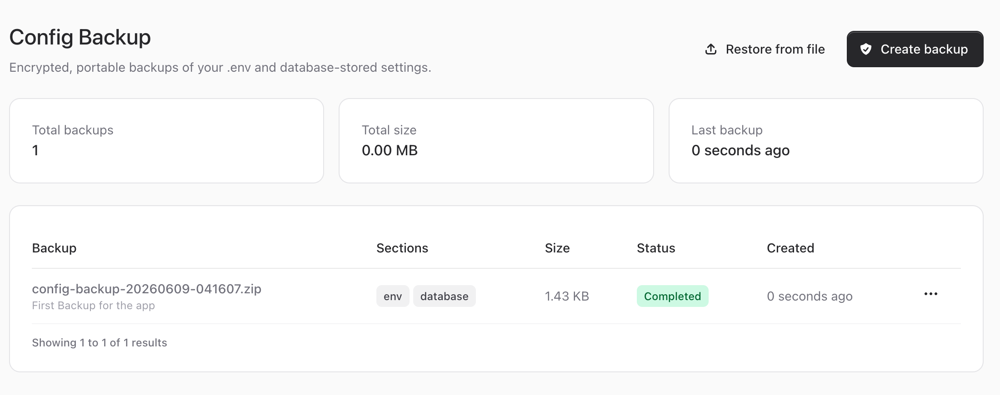
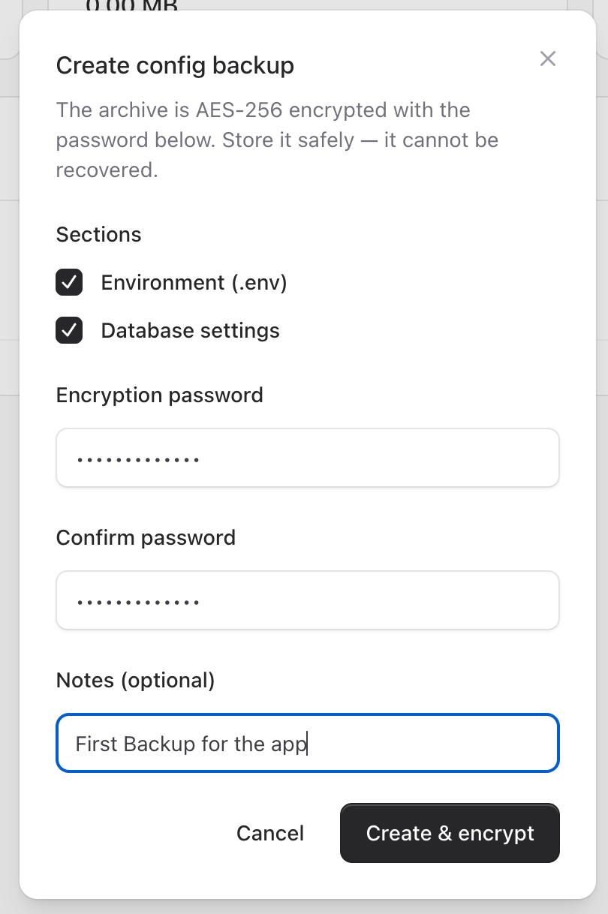

# Web UI

An optional Livewire + Flux management screen. The service and CLI work without it.



## Requirements

Install the UI dependencies in your application:

```bash
composer require livewire/livewire livewire/flux
```

The component is only registered when Livewire is present, and the route only loads when
Livewire is installed and the route is enabled.

## The route

By default the screen is served at `/admin/config-backup`:

```php
// config/config-backup.php
'route' => [
    'enabled' => env('CONFIG_BACKUP_ROUTE_ENABLED', true),
    'prefix' => env('CONFIG_BACKUP_ROUTE_PREFIX', 'admin/config-backup'),
    'name' => 'config-backup.index',
    'middleware' => ['web', 'auth'],
    'layout' => env('CONFIG_BACKUP_LAYOUT', 'components.layouts.app'),
],
```

The view renders inside your app's layout (`layout` key) — point it at a Blade layout
that exists in your application and includes Flux's `@fluxAppearance` / `@fluxScripts`.

## What it does

- **Create backup** — pick sections, enter and confirm the encryption password, add a note.

  

- **Restore** — from a stored backup or an uploaded file, with a section/`.env` preview.
- **Stats & table** — total backups, total size, last backup, and a paginated list with
  status badges.

## Authorization

When `config-backup.gate` is set, the route enforces it via `can:{gate}` middleware
**and** the component re-checks it on mount and on every action. See
[Authorization](../04-guides/01-authorization.md).

## Next Steps

- [Authorization](../04-guides/01-authorization.md)
- [Local development (workbench)](../04-guides/03-local-development.md) — to preview the UI
  without wiring it into an app.
